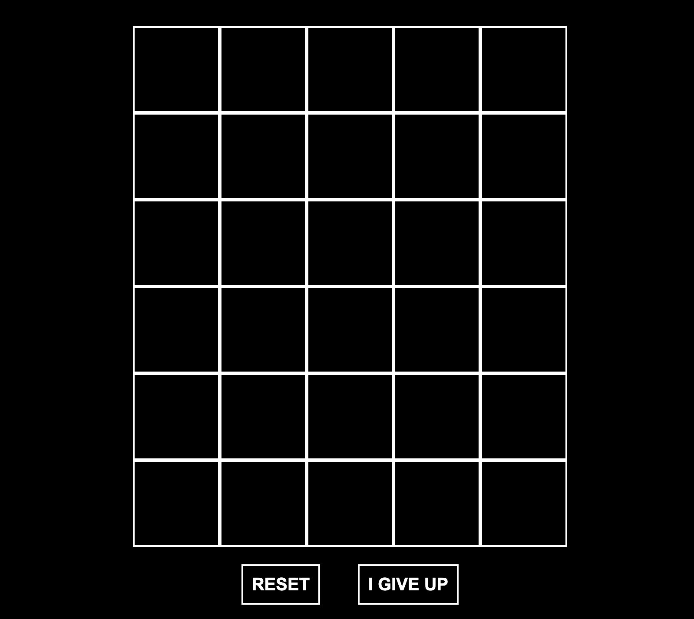

<h1 align="center">
	WORLDLE
</h1>

My first javascript micro-project.

---

  

---

## Author

- [`@achrafelkhnissi`]() | Software Engineer Student

    > Reach out to me if you need any help or have any questions.

	
	 * 
    
     * 
    
     * 
    
---
